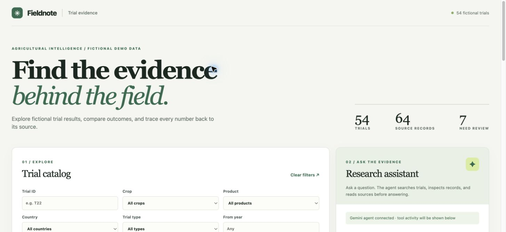

# Agricultural Trial Evidence App

A browser app for finding and comparing agricultural trials while keeping every result linked to its original CSV row or report. The default demo catalog contains 54 fictional trials: the six supplied records plus 48 deterministic synthetic records. The generated values are for application testing only, never agronomic claims.



The browser streams tool activity and Gemini answer text while the agent investigates a question. [See the agent preview](docs/agent.png).

## Run locally

Requires Python 3.11+ and [uv](https://docs.astral.sh/uv/). From this directory:

```bash
uv sync
uv run uvicorn app.main:app --reload --host 127.0.0.1 --port 8000
```

Open <http://127.0.0.1:8000>. The catalog, filters, comparisons, and source links work without an LLM credential. API documentation is at <http://127.0.0.1:8000/docs>. Set `TRIAL_DATA_DIR=sample-data` before startup to use only the original six fictional trials.

To enable the Gemini agent, set a Google Gemini API key before starting the server:

```bash
export GOOGLE_API_KEY="your-key"
# Optional: defaults to gemini-3.8-flash
export GOOGLE_MODEL="gemini-3.8-flash"
uv run uvicorn app.main:app --reload --host 127.0.0.1 --port 8000
```

`GEMINI_API_KEY` is accepted as an alternative key variable. No credentials are stored in the repository. The agent calls Google's Gemini API with trial data from the question and tool results, so use an approved endpoint for real client data. `TRIAL_DATA_DIR` can point to another directory of files with the two supported CSV schemas and the supplied report layout.

To rebuild the expanded synthetic catalog:

```bash
uv run python scripts/generate_demo_data.py
```

The generated files are in `demo-data/`. Its `manifest.json` lists the intentional conflicts and missing values. The app loads `demo-data/` by default when that directory exists; restart after switching datasets.

Run checks with `uv run python -m unittest discover -s tests -v`.

## Business understanding

Agronomists need to find earlier trials before planning new work, and commercial teams need to evaluate product claims against source-backed evidence. The app provides normalized search, side-by-side comparison, source inspection, and an agent that investigates a question through catalog tools.

The supplied files are fictional. I treat a trial ID as the identity key and preserve every file's observation under that ID. A numerical treated/control difference is descriptive; it does not demonstrate a causal effect or statistical significance. The sources do not provide the replication and analysis needed for that conclusion. A missing control or unresolved source conflict prevents a single effect from being calculated.

Questions for the client: Which system owns the final result when sources disagree? What trial design, replication, and statistical fields are available in the full dataset? Which claim approval rules should commercial users follow? Are trial IDs unique across countries and years?

## How it works

- Import runs at startup from `demo-data/` by default, or from the directory named by `TRIAL_DATA_DIR`. Both CSV layouts and report extracts become normalized observations. Product and crop aliases, country codes, and kg/ha values are standardized.
- Observations with the same trial ID become one record. T01 and T02 have agreeing duplicate observations. T03 retains both 42 and 44 t/ha treated yields and is flagged as conflicting. T05 remains incomplete because the control is missing. T06 is imported from its report alone.
- Search filters use trial ID, normalized crop, product, country, year range, and trial type. The catalog shows 12 records per page when a dataset is larger than one page. Trial detail shows each raw observation and opens its source. Comparison reports only defensible effects. Agreed treated or control measurements remain visible even when a conflicting or incomplete trial has no calculable effect.
- The agent uses LangChain tools (`search_trials`, `get_trial`, `read_source`, `compare_trials`) inside a LangGraph model → tools → model loop. The model chooses the next action after seeing tool results. The UI streams observable decision notes, intermediate tool summaries, expandable full results, and the answer as Gemini generates its text chunks. A loader stays visible throughout the run, and the completed answer is formatted and linked to its original sources. Decision notes describe visible tool choices and results; they do not expose private model reasoning. If model configuration is absent, the catalog remains usable and the agent displays setup guidance.
- The graph allows up to 12 tool rounds. If a question still needs more checks, the agent summarizes the evidence already gathered with tools disabled; if it cannot make a reliable summary, it asks for a narrower question instead of failing with a recursion-limit error.

## API

| Endpoint | Purpose |
| --- | --- |
| `GET /api/trials` | Filter records by `trial_id`, `crop`, `product`, `country`, `year_from`, `year_to`, `trial_type` |
| `GET /api/trials/{trial_id}` | Full record with observations and warnings |
| `POST /api/compare` | Compare a list of trial IDs |
| `GET /api/sources/{source_name}` | Original CSV or report text |
| `POST /api/agent/ask` | Answer plus tool activity and completion status |
| `POST /api/agent/stream` | Live server-sent events for status, tool calls, tool results, answer text chunks, and final answer |
| `GET /api/facets` | Filter options |
| `GET /api/health` | Catalog count and agent configuration state |

Example agent request:

```bash
curl -s http://127.0.0.1:8000/api/agent/ask \
  -H 'Content-Type: application/json' \
  -d '{"question":"Compare Harvest Plus wheat results in France and Germany"}'
```

For the live stream, use `curl -N` with `/api/agent/stream`. Each SSE `data:` frame is a JSON event. `answer_token` carries the next visible text chunk; `answer_reset` clears a draft if the model chooses another tool; `final` supplies the complete formatted answer and source list.

```bash
curl -N http://127.0.0.1:8000/api/agent/stream \
  -H 'Content-Type: application/json' \
  -d '{"question":"What happened in the T01 wheat trial?"}'
```

## Five-minute demonstration (set `TRIAL_DATA_DIR=sample-data`)

1. **0:00–1:00** Open the catalog; filter to Wheat and Harvest Plus. Show four normalized records across three countries.
2. **1:00–2:00** Open T02. Show `7800 kg/ha` in the CSV and `7.8 t/ha` in the report resolving to the same value. Open both original sources.
3. **2:00–3:00** Select T01 and T02 and compare their descriptive yield changes. Open T03 to show the unresolved 42/44 t/ha conflict, then T05's missing control.
4. **3:00–4:30** With model variables configured, ask “What evidence supports Root Boost improving potato yields?” Watch the loader and decision log update as the agent searches, inspects records, and reads sources. Expand a step to see its full tool result. The answer appears progressively as Gemini generates it and should distinguish T03's conflict and T04's zero difference.
5. **4:30–5:00** Ask about Harvest Plus on rice. Show that an empty search is reported as no evidence in this catalog, not evidence of ineffectiveness.

## Checks, tradeoffs, and next milestone

Automated tests cover normalization, duplicate merging, conflicts, missing values, search, source access, comparison, streaming events, token chunks before completion, generated file ingestion, expanded-catalog API routes, and scripted LangGraph runs that use three tools in sequence. Browser checks covered filters, trial details, comparison, the live loader, intermediate tool results, expandable raw outputs, and a completed Gemini answer with source links.

The importer is deliberately schema-specific and reloads at startup. It is enough for the supplied assignment files, but it is not a general document extraction pipeline. Storage is in memory, there is no authentication or claim approval workflow, and model answers still require human review before commercial use. The next milestone is a persisted ingestion queue with configurable field mappings, source versioning, and explicit human resolution of conflicts.
